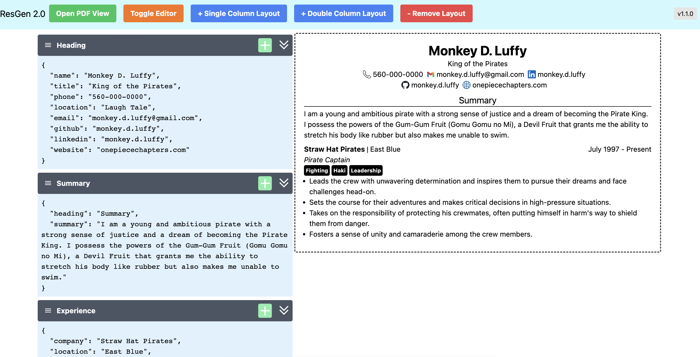

[](https://app.netlify.com/sites/res-gen-2/deploys)

# [ResGen 2.0](https://res-gen-2.netlify.app/#/)



## Local Development

```
nvm use
npm install
npm run dev
```

### Notes

_Based on ResGen project and some design ideas from Confluence_

- [ResGen](https://res-gen.netlify.app/)
- [Confluence](https://dko.atlassian.net/wiki/spaces/~70121175db255b3d342a8a80314a7e70dc73d/pages/262145/Testing+Space+for+ResGen2)

## Technology

- [ReactJS](https://react.dev/)
- [NextJS](https://nextjs.org/)
- [ReactDnD](https://react-dnd.github.io/react-dnd/about)
- [TailwindCSS](https://tailwindcss.com/)
- [@react-pdf/renderer](https://react-pdf.org/)

## DevOps

- [eslint](https://eslint.org/)
- [prettier](https://prettier.io/)
- [husky](https://typicode.github.io/husky/)
- [semantic-release](https://github.com/semantic-release/semantic-release)
- [commitlint](https://commitlint.js.org/#/)

### Deleting bad tags

```
git push --delete origin v1.0.0
```
